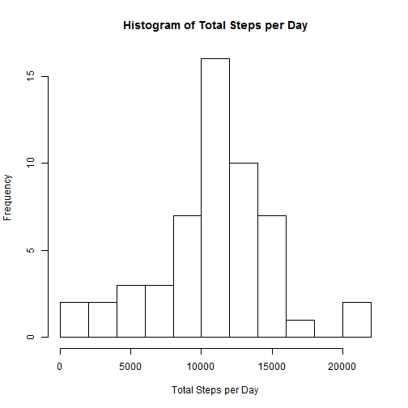
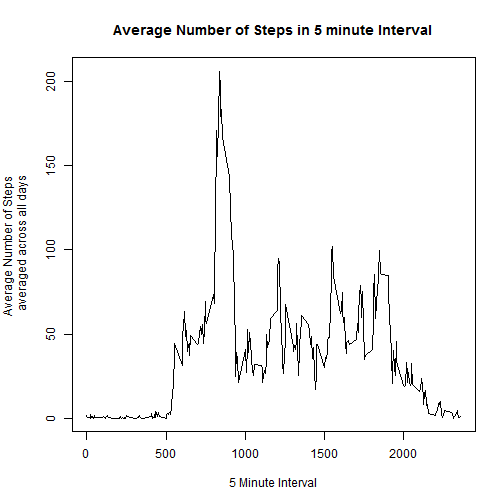
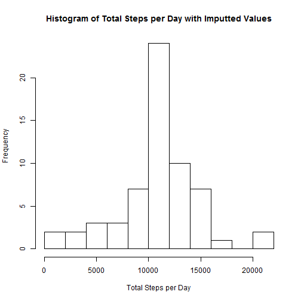
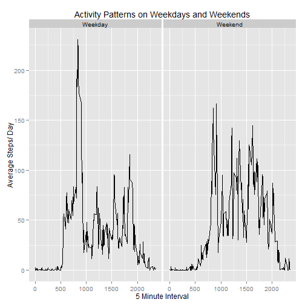

## Loading and preprocessing the data

Loads relevant packages


```r
library(dplyr)
library(lubridate)
library(ggplot2)
```

Unzips and loads dataset


```r
unzip("activity.zip")
activity<-read.csv("activity.csv")
```

## What is mean total number of steps taken per day?

Function filters out data where steps=NA, groups by date and summarizes the total steps based on the groups


```r
Total_Step<-function(data){
        steps_data<<-filter(data,steps!="NA")%>%
                group_by(date)%>%
                summarize(total.steps=sum(steps))
}
```
Runs the function for the activity data  
Creates a histogram  
Calculates the mean and median total number of steps


```r
Total_Step(activity)

hist(steps_data$total.steps, main="Histogram of Total Steps per Day", xlab="Total Steps per Day", breaks=10)
```

 

```r
mean(steps_data$total.steps)
```

```
## [1] 10766.19
```

```r
median(steps_data$total.steps)
```

```
## [1] 10765
```


## What is the average daily activity pattern?

Function filters out data with steps=NA, groups by interval and summarizes the mean based on the groups


```r
Avg_Step<-function(data){
        time_data<<-filter(data,steps!="NA")%>%
                group_by(interval)%>%
                summarize(avg.steps=mean(steps)) 
}
```
Runs the function using the activity data  
Creates a plot of average number of steps vs interval  
Determines the interval that contains the max number of average steps


```r
Avg_Step(activity)

par(mar=c(5,5,4,2))
plot(x=time_data$interval, y=time_data$avg.steps, type="l", main="Average Number of Steps in 5 minute Interval", xlab="5 Minute Interval", ylab="Average Number of Steps \n averaged across all days")
```

 

```r
time_data$interval[which.max(time_data$avg.steps)]
```

```
## [1] 835
```


## Imputing missing values

Function calculates the total number of NAs, runs the Avg_step function for activity to calculate the average steps for each interval, and creates a new data set with the imputted values


```r
Impute<-function(data){
        number_of_NA<<-sum(is.na(data$steps))
        
        missing_data<<-data[is.na(data$steps),]
        
        Avg_Step(data)
        merged_data<<-inner_join(missing_data, time_data)
        
        new_activity<<-data
        new_activity$steps[is.na(new_activity$steps)]<<-merged_data$avg.steps
}
```
Runs the impute function to create the new data set  
Runs the Total_step function with the imputted dataset  
Creates a histogram and calculates the mean and median for the imputted dataset


```r
Impute(activity)
```

```
## Joining by: "interval"
```

```r
Total_Step(new_activity)

hist(steps_data$total.steps, main="Histogram of Total Steps per Day with Imputted Values", xlab="Total Steps per Day", breaks=10)
```

 

```r
mean(steps_data$total.steps)
```

```
## [1] 10766.19
```

```r
median(steps_data$total.steps)
```

```
## [1] 10766.19
```


## Are there differences in activity patterns between weekdays and weekends?

Runs the impute function to create the imputted dataset


```r
Impute(activity)
```

```
## Joining by: "interval"
```

creates a new dataset with a new column for the day of the week


```r
weekday_data<-mutate(new_activity, day=weekdays(ymd(date)))
```

Function that returns weekday or weekend for the day of the week


```r
Correct_Weekday<-function(day){
        if ((day=="Saturday")|(day=="Sunday")){
                return ("Weekend")
        }else{
                return ("Weekday")
        }
}
```

Applies the created function for each observation in the dataset


```r
weekday_data$day<-sapply(weekday_data$day, Correct_Weekday)
```

Creates a new dataset that groups the data by the day and interval and summarizes the average steps based on the groups


```r
grouped_weekday_data<-group_by(weekday_data,day, interval)%>%
        summarize(avg.steps=mean(steps))
```

Creates a plot of average steps vs interval for the grouped data


```r
print(qplot(interval, avg.steps, data=grouped_weekday_data, geom="line", facets=.~day, xlab="5 Minute Interval", ylab="Average Steps/ Day", main="Activity Patterns on Weekdays and Weekends"))
```

 
